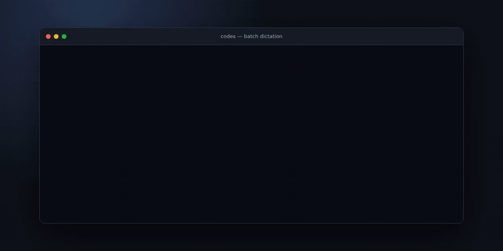
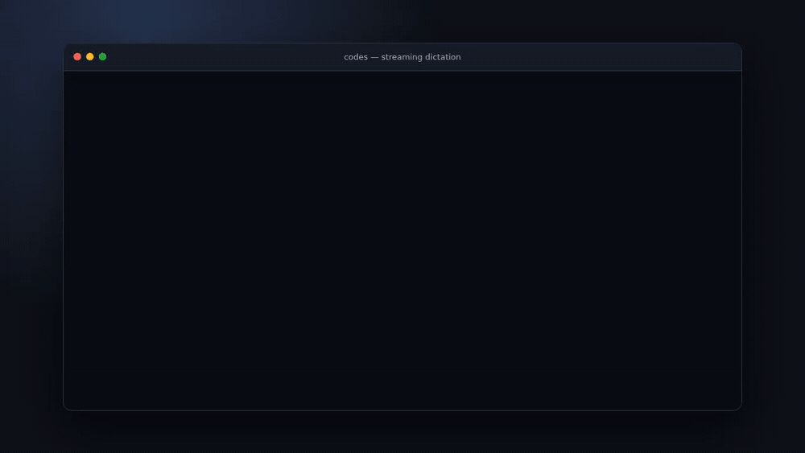

# Codes

Codes is a project for converting medical dictations into billing codes.

## Install

Standalone executables are published for Linux (x64 and arm64) and macOS (Intel
and Apple silicon). They include the Node.js runtime and the billing-code
catalog, so Node.js and pnpm are not required.

On Linux or macOS:

```sh
curl -fsSL https://raw.githubusercontent.com/NAlexPear/codes/main/scripts/install.sh | sh
```

The installer detects the operating system and architecture, verifies the
release archive against `SHA256SUMS`, and installs the latest release. Set
`CODES_VERSION=v0.1` to pin a version or `CODES_INSTALL_DIR` to choose the
destination. Archives are also available directly from
[GitHub Releases](https://github.com/NAlexPear/codes/releases).

## Demo

### File input



### Streaming dictation



The demos show the interactive loader and color-coded results. Streaming output
updates its provisional table in place when the dictation ends by voice command.

## Usage

Set `TYPESAFE_API_KEY`, then provide a dictation as a file or through stdin. The
CLI evaluates it against the packaged internal billing-code catalog.

```sh
pnpm start --input dictation.txt
cat dictation.txt | pnpm start
```

The default output is a color-coded table and shows an interactive loader when
run in a terminal. Use `--output json` or `-o json` for pretty-printed JSON:

```sh
pnpm start --input dictation.txt --output json
```

Each returned code includes an `Evidence` row copied verbatim from the
dictation. Codes requiring manual review also include an `Action` row naming the
documentation issue to resolve, such as laterality, anatomy, encounter status,
or procedure detail. Manual-review results can include separate excerpts for the
underlying clinical support and the unresolved detail. JSON output exposes the
same information in each code's `evidence` and `review` fields.

### Real-time dictation

Pass `--stream` (or `-s`) to read newline-delimited JSON (NDJSON) events from
stdin. `--input` can replay the same protocol from a file. Transcript events
with the same `segmentId` replace interim speech-recognition hypotheses, and
their `sequence` values must increase strictly.

```sh
cat <<'EOF' | pnpm start -s
{"type":"start","sessionId":"case-123"}
{"type":"transcript","sequence":1,"segmentId":"s1","text":"Open carpal tunnel","final":false}
{"type":"transcript","sequence":2,"segmentId":"s1","text":"Open carpal tunnel release","final":true}
{"type":"end","sequence":3}
EOF
```

The optional `start` event must come first. An `end` event or EOF finalizes the
dictation. A standalone finalized transcript event containing
`end dictation for doctor <doctor name>` also finalizes it; the command is not
included in the medical transcript. Interim events and longer sentences
containing those words do not trigger termination.

The default stream output updates its color-coded table in place. When output is
redirected, snapshots are appended without terminal control codes. With
`--output json`, the CLI writes complete code snapshots as NDJSON. Provisional
snapshots have `"final":false`; the last snapshot has `"final":true` and a
`termination` object. To keep live updates responsive, evidence and review
actions are added only to the final snapshot. Extraction is debounced, only one
request runs at a time, and stale results are suppressed when a newer transcript
revision arrives.

## Sample data

[`data/hand-surgery-dictations.json`](data/hand-surgery-dictations.json)
contains ten original synthetic hand-surgery operative dictations.
[`data/hand-surgery-source-evals.json`](data/hand-surgery-source-evals.json)
adds 36 source-grounded evaluations: complete, ambiguous, and truncated variants
derived from 12 attributed CC BY 4.0 publications. See
[`data/README.md`](data/README.md) for the schema, provenance, and important
coding limitations.

## Status

This project is in early development. Setup and usage instructions will be added
as the implementation takes shape.

## Development

Use Node.js 24 or newer and pnpm:

```sh
pnpm install --frozen-lockfile
pnpm check
```

Build a standalone executable for the current operating system and CPU:

```sh
pnpm build
./dist/codes --help
```

Pushing a `v*` tag runs the release workflow, which verifies the project, builds
each supported platform natively, checks that its catalog is embedded, and
publishes the archives and checksums as a GitHub release.

`pnpm check` enforces Oxfmt formatting, all Oxlint rule categories, type-aware
linting, strict TypeScript checks, and tests. Unit tests use only Node's
built-in `node:test` and `node:assert/strict` modules. Run `pnpm fix` to apply
all safe Oxlint fixes and Oxfmt formatting.

Run the labeled corpus against Jev separately from the deterministic unit suite:

```sh
TYPESAFE_API_KEY=... pnpm eval
```

Run the 12-case actionable-evidence benchmark through the complete Jev
classification and enrichment pipeline:

```sh
TYPESAFE_API_KEY=... pnpm eval --evidence
```

This opt-in benchmark deterministically scores verbatim grounding, evidence
recall, required-term sufficiency, review-category accuracy, and disposition
stability. It also reports combined two-call latency and token usage. The
default provider-comparison benchmark remains disposition-only.

Use the same `eval` command to compare Jev with OpenAI Responses API models.
Repeat `--provider` and `--model` in matching order, and use `--repetitions` to
measure consistency:

```sh
OPENAI_API_KEY=... pnpm eval --provider openai --model gpt-6-astra
TYPESAFE_API_KEY=... OPENAI_API_KEY=... pnpm eval \
  --provider jev --provider openai \
  --model jev-1.13.0 --model gpt-6-astra \
  --repetitions 3
```

Every provider receives the same dictation, catalog, candidate guidance, and
three-way decision criteria. OpenAI uses strict Structured Outputs and returns a
choice for every candidate; Jev retains its native probabilities and confidence
thresholds. Both normalize to automatic, manual-review, or omitted dispositions
before the shared scorer runs.

The eval exits unsuccessfully when a candidate falls outside its accepted
dispositions. Its JSON report includes per-run failures, aggregate disposition
counts, resolved model IDs, input and output tokens, model-call counts, and p50
and p95 latency. Source-grounded cases can require either an automatic result or
a manual-review result; candidates without explicit labels must never become
automatic matches.

### Benchmark snapshot

Jev 1.13 and GPT-5.6 Luna were each evaluated three times sequentially against
the same 46-case corpus and 91-code catalog. Each provider received the same
dictation, candidate questions, guidance, and disposition policy in one model
call per case. A case-run passed only when every labeled decision was accepted
and no unlabeled code was selected automatically.

| Metric                                   |            Jev 1.13 |        GPT-5.6 Luna |
| ---------------------------------------- | ------------------: | ------------------: |
| Passing case-runs                        |      138/138 (100%) |     133/138 (96.4%) |
| Accepted labeled decisions               |      324/324 (100%) |     318/324 (98.1%) |
| Unlisted codes selected automatically    |                   0 |                   0 |
| Review-only codes selected automatically |                   0 |                   1 |
| Unlabeled codes sent to manual review    |                 144 |                  10 |
| Input/output tokens                      | 7,551,573 / 513,686 | 6,105,306 / 118,809 |
| Latency p50 / p95                        |     456 ms / 588 ms |    6.43 s / 36.84 s |
| Total sequential runtime                 |              65.5 s |           1,202.9 s |
| Estimated three-run cost                 |             $0.3172 |             $1.3636 |
| Estimated cost per case                  |            $0.00230 |            $0.00988 |

Jev was about 4.3× less expensive and 14.1× faster at median latency, with no
scoring failures across the three runs, but it produced more conservative
manual-review suggestions. Luna reduced that review burden, while making six
unaccepted labeled decisions, including one automatic selection that an
ambiguous source required to be reviewed. Luna's observed p95 includes waits
imposed by the test account's 60,000-token-per-minute rate limit.

Costs use the providers' published list prices— [Jev at
$0.042 per million input tokens with free output](https://docs.typesafe.ai/models#current-models)
and
[GPT-5.6 Luna at $0.20
per million input tokens and
$1.20 per million output tokens](https://developers.openai.com/api/docs/models/gpt-5.6-luna)—without
cached-input discounts. At 30 procedures per week for 52 weeks, the measured
per-case rates project to about $3.59/year
for Jev and $15.40/year for Luna when performing one final extraction per
procedure. Streaming revisions, future catalog growth, provider price changes,
and infrastructure costs are excluded.

## License

This project is licensed under the [MIT License](LICENSE).
