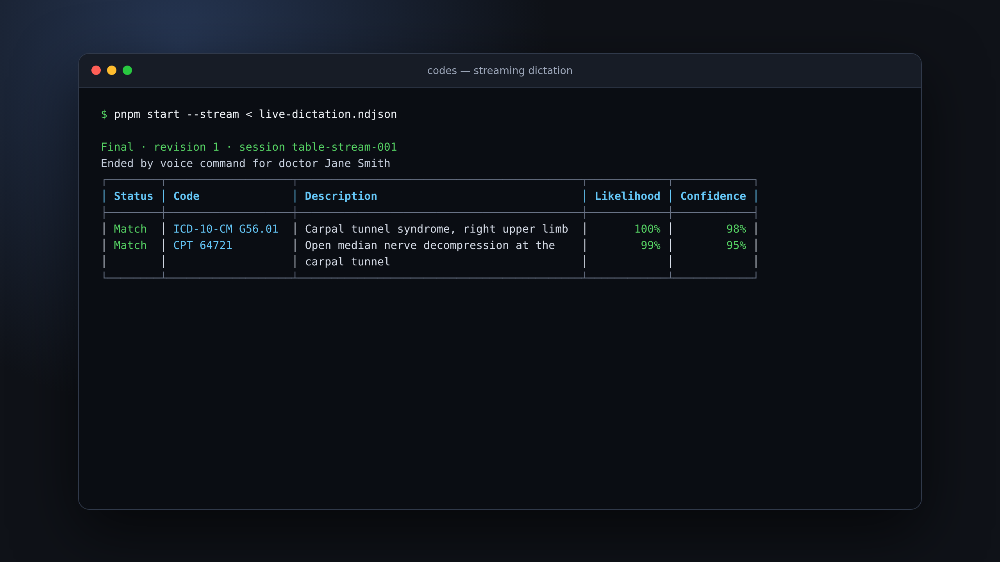

# Codes

Codes is a project for converting medical dictations into billing codes.

## Demo

[](docs/assets/codes-cli-full-demo.mp4)

[Watch the full demo](docs/assets/codes-cli-full-demo.mp4) to see the
interactive loader, color-coded results, and a provisional streaming table
update in place when the dictation ends by voice command.

## Usage

Set `TYPESAFE_API_KEY`, then provide a dictation as a file or through stdin. The
CLI evaluates it against the packaged internal billing-code catalog.

```sh
pnpm start --input dictation.txt
cat dictation.txt | pnpm start
```

The default output is a color-coded table and shows an interactive loader when
run in a terminal. Use `--output json` or `-o json` for pretty-printed JSON:

```sh
pnpm start --input dictation.txt --output json
```

### Real-time dictation

Pass `--stream` (or `-s`) to read newline-delimited JSON (NDJSON) events from
stdin. `--input` can replay the same protocol from a file. Transcript events
with the same `segmentId` replace interim speech-recognition hypotheses, and
their `sequence` values must increase strictly.

```sh
cat <<'EOF' | pnpm start -s
{"type":"start","sessionId":"case-123"}
{"type":"transcript","sequence":1,"segmentId":"s1","text":"Open carpal tunnel","final":false}
{"type":"transcript","sequence":2,"segmentId":"s1","text":"Open carpal tunnel release","final":true}
{"type":"end","sequence":3}
EOF
```

The optional `start` event must come first. An `end` event or EOF finalizes the
dictation. A standalone finalized transcript event containing
`end dictation for doctor <doctor name>` also finalizes it; the command is not
included in the medical transcript. Interim events and longer sentences
containing those words do not trigger termination.

The default stream output updates its color-coded table in place. When output is
redirected, snapshots are appended without terminal control codes. With
`--output json`, the CLI writes complete code snapshots as NDJSON. Provisional
snapshots have `"final":false`; the last snapshot has `"final":true` and a
`termination` object. Extraction is debounced, only one request runs at a time,
and stale results are suppressed when a newer transcript revision arrives.

## Sample data

[`data/hand-surgery-dictations.json`](data/hand-surgery-dictations.json)
contains ten original synthetic hand-surgery operative dictations.
[`data/hand-surgery-source-evals.json`](data/hand-surgery-source-evals.json)
adds 36 source-grounded evaluations: complete, ambiguous, and truncated variants
derived from 12 attributed CC BY 4.0 publications. See
[`data/README.md`](data/README.md) for the schema, provenance, and important
coding limitations.

## Status

This project is in early development. Setup and usage instructions will be added
as the implementation takes shape.

## Development

Use Node.js 24 or newer and pnpm:

```sh
pnpm install --frozen-lockfile
pnpm check
```

`pnpm check` enforces Oxfmt formatting, all Oxlint rule categories, type-aware
linting, strict TypeScript checks, and tests. Unit tests use only Node's
built-in `node:test` and `node:assert/strict` modules.

Run the labeled synthetic corpus against Jev separately from the deterministic
unit suite:

```sh
TYPESAFE_API_KEY=... pnpm eval
```

The eval exits unsuccessfully when a candidate falls outside its accepted
dispositions. Source-grounded cases can require either an automatic result or a
manual-review result; candidates without explicit labels must never become
automatic matches. The JSON output separates automatic matches, manual-review
matches, and omitted candidates and retains each candidate's full probability
distribution.

## License

This project is licensed under the [MIT License](LICENSE).
